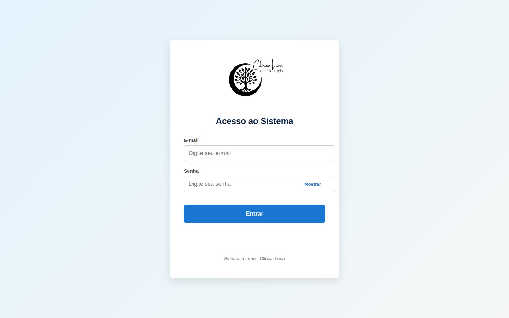
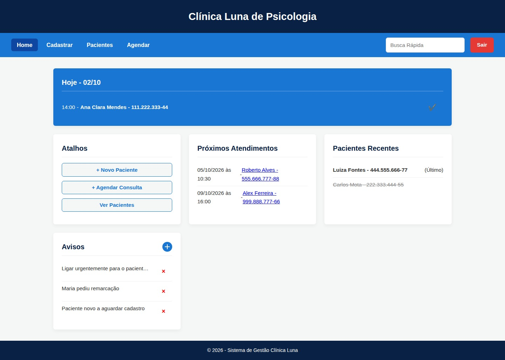
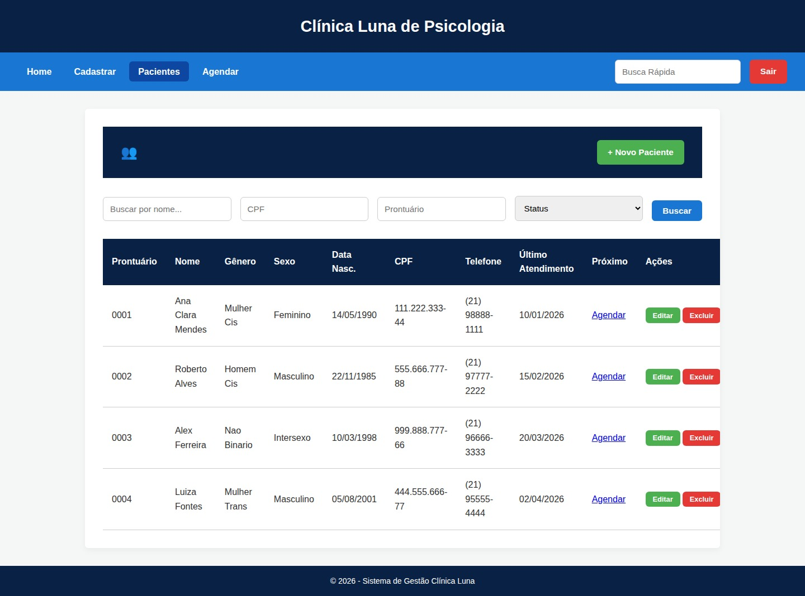
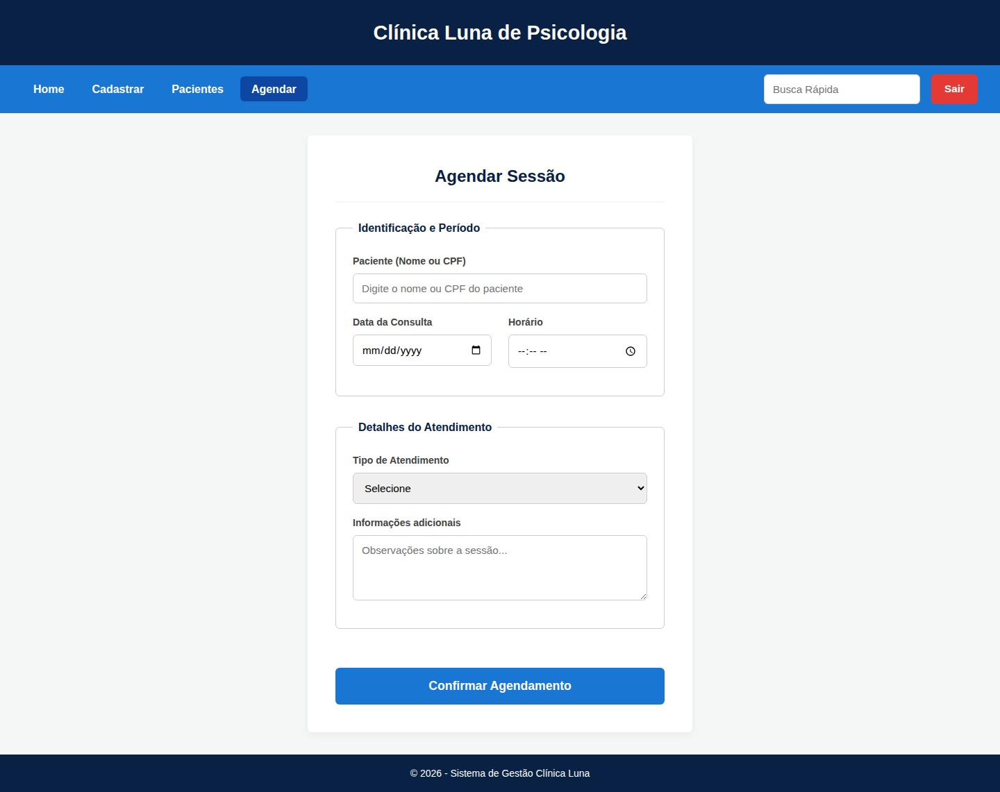
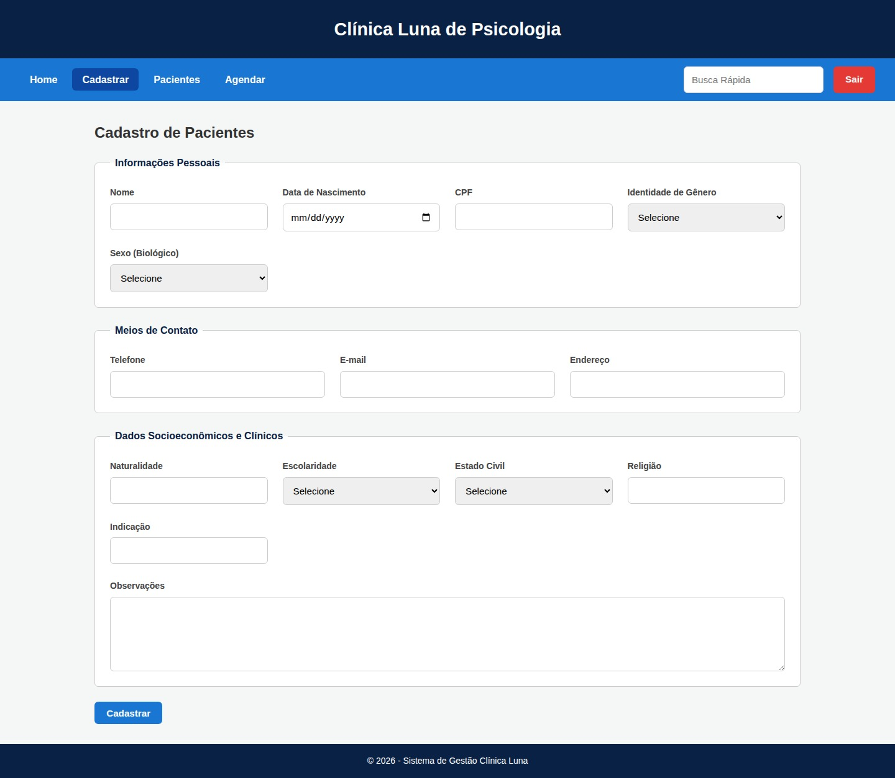

# Sistema Luna — Gestão de Clínica de Psicologia

Sistema web de gestão para consultórios de psicologia, desenvolvido como projeto extensionista em equipe de 5 integrantes. A aplicação está **em uso real por uma psicóloga**, cobrindo o fluxo completo de cadastro de pacientes, agendamento de sessões e acompanhamento diário dos atendimentos.

## Funcionalidades

- Autenticação de usuário via login com token de sessão
- Dashboard com resumo do dia: atendimentos de hoje, próximos agendamentos e pacientes atendidos recentemente
- Cadastro completo de pacientes, incluindo dados pessoais, de contato e informações socioeconômicas/clínicas
- Listagem de pacientes com busca por nome, CPF, número de prontuário e status
- Agendamento de sessões com tipo de atendimento (avulso ou pacote mensal) e observações
- Conclusão de atendimentos diretamente pelo dashboard
- Mural de avisos internos, persistido no navegador

## Telas

| Dashboard | Pacientes |
|---|---|
|  |  |

| Agendar Sessão | Cadastro de Paciente |
|---|---|
|  |  |

## Tecnologias

- **Front-end:** HTML5, CSS3, JavaScript (Vanilla, sem frameworks)
- **Back-end:** PHP, com arquitetura de endpoints REST simples (um arquivo por ação)
- **Banco de dados:** MySQL (via PDO, com queries preparadas)
- **Autenticação:** token de sessão gerado no login e validado a cada requisição protegida

## Como rodar (XAMPP)

1. Copie a pasta do projeto para `htdocs` (ex: `C:\xampp\htdocs\SistemaLuna`).
2. No **phpMyAdmin**, importe o arquivo `dataBase/clinica_luna.sql` — ele cria o banco `clinica_luna`, as tabelas (`usuarios`, `pacientes`, `agendamentos`) e já insere pacientes e agendamentos de exemplo.
3. Crie um usuário de acesso executando `backend/criar_admin.php` (ou inserindo manualmente um registro na tabela `usuarios` com senha via `password_hash()`).
4. Confira as credenciais do banco em cada arquivo do `backend/` (por padrão, usuário `root` e senha vazia, padrão do XAMPP).
5. Inicie o Apache e o MySQL no painel do XAMPP.
6. Acesse `http://localhost/SistemaLuna/frontend/html/login.html`.

## Arquitetura

- **`frontend/html/`** — as 5 telas da aplicação (login, dashboard, pacientes, agendar e cadastro), todas consumindo o back-end via `fetch`.
- **`frontend/css/`** — um arquivo de estilo por tela, mais um `global.css` compartilhado (header, navbar, rodapé).
- **`js/script.js`** — toda a lógica de interface: carregamento do dashboard, filtros da listagem, envio dos formulários de cadastro e agendamento, e o mural de avisos.
- **`js/auth.js`** — controla a sessão no front-end: redireciona para o login se não houver token, valida o token a cada carregamento de página e trata o botão de sair.
- **`backend/`** — um arquivo PHP por ação (`login.php`, `cadastrar_paciente.php`, `listar_pacientes.php`, `agendar_consulta.php`, `editar_paciente.php`, `excluir_paciente.php`, `marcar_atendido.php`, `buscar_paciente.php`), todos retornando JSON.
- **`backend/verifica_auth.php`** — middleware de autenticação, incluído (`require_once`) no topo de cada endpoint protegido; também abre a conexão PDO reutilizada pelo restante do script.
- **`dataBase/clinica_luna.sql`** — schema completo do banco, já com dados fictícios de exemplo para teste.

## Decisões técnicas

- **Autenticação por token simples:** no login, é gerado um token aleatório (`random_bytes`) salvo no banco e devolvido ao front-end, que o guarda em `sessionStorage` e o envia no header `Authorization` em toda requisição protegida — sem uso de JWT, mantendo a implementação simples e adequada ao escopo do projeto.
- **Senhas com hash:** armazenadas com `password_hash()` e validadas com `password_verify()`, nunca em texto puro.
- **Middleware de autenticação centralizado:** `verifica_auth.php` é incluído via `require_once` em cada endpoint sensível, evitando duplicar a lógica de validação de token e de conexão com o banco em cada arquivo.
- **Separação de gênero e sexo biológico no cadastro:** o formulário trata identidade de gênero e sexo biológico como campos distintos, refletindo uma prática recomendada em prontuários de saúde mental.
- **Avisos persistidos no navegador:** o mural de avisos do dashboard usa `localStorage` em vez do banco de dados, por ser um recurso de anotação rápida e pessoal da psicóloga, sem necessidade de sincronização entre dispositivos.
- **Dashboard com três recortes de tempo:** os agendamentos são separados em "hoje", "próximos" e "recentes" diretamente via queries SQL com `CURDATE()`, simplificando a lógica no front-end.

## Status

**Em uso real por uma psicóloga em sua clínica.** Todas as funcionalidades principais — login, dashboard, cadastro, listagem, agendamento e conclusão de atendimentos — estão implementadas e em produção.
